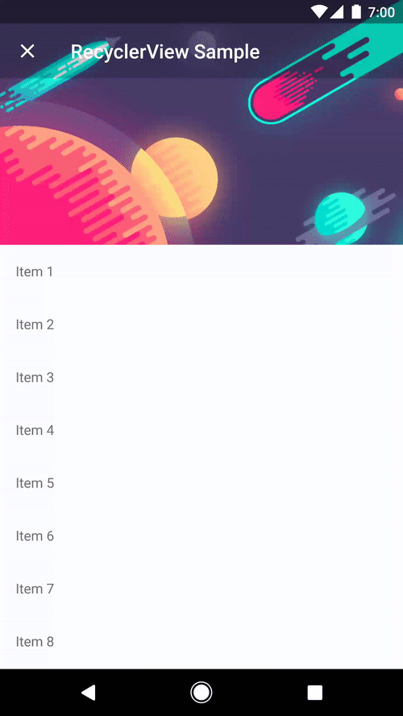

# Android Drag Dismiss Activity

Another implementation of the drag-to-dismiss `Activity` pattern. This one is inspired by Nick Butcher's [Plaid](https://github.com/nickbutcher/plaid/blob/master/app/src/main/java/io/plaidapp/ui/widget/ElasticDragDismissFrameLayout.java) implementation.

The project has a simple API and is a pretty powerful and beautiful implementation of the pattern. This library is used in some of my apps ([Talon for Twitter](https://play.google.com/store/apps/details?id=com.klinker.android.twitter_l) and [Pulse SMS](https://play.google.com/store/apps/details?id=xyz.klinker.messenger)). It has been abstracted from Jacob Klinker and I's [article-android](https://github.com/klinker41/article-android/) library, which is an awesome readability style in-app web browser.

This library provides an elastic layout that can dismiss an `Activity` with a `RecyclerView` or a regular `Activity`. Whenever the user swipes up or down, from the bottom or the top of the content, the `DragDismissActivity` will finish.

## Including It In Your Project



This project was designed to be very easy to implement on top of your existing `Activities`.

To include it in your project, add this to your module's `build.gradle` file:

```groovy
dependencies {
	...
	compile 'com.klinkerapps:drag-dismiss-activity:0.0.1-SNAPSHOT'
}
```

#### Replacing an Activity

This library is meant to replace your `AppCompatActivity`. I will set up all the drag-dismiss features for you, and wrap your content in a boilerplate UI that contains a `Toolbar` and a `ScrollView` for your content.

`DragDismissActivity` is easy to implement:

1. Within your `AndroidManifest.xml`, on your `activity` elements replace whatever theme you are currently using with `android:theme="@style/DragDismissTheme`.
2. Instead of extending `AppCompatActivity`, extend the `DragDismissActivity`.
3. You won't want to override `Activity#onCreate`. Instead, override `DragDismissActivity#onCreateContent`. This method acts a bit like `Fragment#onCreateView`:

```java
@Override
protected View onCreateContent(LayoutInflater inflater, ViewGroup parent) {
    View v = inflater.inflate(R.layout.activity_scrollable, parent, false);

    // do your normal view setup and Activity#onCreate lifecycle actions here, 
    // instead of within the Activity#onCreate.
    
    return v;
}
```

For a very simple example, please see [DismissableActivityNormalContent Sample](https://github.com/klinker24/Android-DragDismissActivity/blob/master/sample/src/main/java/xyz/klinker/drag_dismiss/DismissableActivityNormalContent.java).

#### Replacing an Activity with a RecyclerView

If you are using an `Activity` that just has a `RecyclerView` in it, then this library can do all the heavy-lifting for you, all you will need to do is set it up with a `RecyclerView.Adapter` and a `LayoutManager`.

`DragDismissRecyclerViewActivity` is easy to implement as well:

1. Within your `AndroidManifest.xml`, on your `activity` elements replace whatever theme you are currently using with `android:theme="@style/DragDismissTheme`.
2. Instead of extending `AppCompatActivity`, extend the `DragDismissRecyclerViewActivity`.
3. You won't want to override `Activity#onCreate`. Instead, to set up your `RecyclerView`, override `DragDismissRecyclerViewActivity#setupRecyclerView`:

```java
@Override
protected void setupRecyclerView(RecyclerView recyclerView) {
    recyclerView.setLayoutManager(new LinearLayoutManager(this));
    recyclerView.setAdapter(new SampleAdapter());
    
    // do any other RecyclerView or Activity setup that needs to be done
}
```

For a very simple example, please see [DismissableActivityRecyclerView Sample](https://github.com/klinker24/Android-DragDismissActivity/blob/master/sample/src/main/java/xyz/klinker/drag_dismiss/DismissableActivityRecyclerView.java).

### Customizing the Boilerplate UI

After implementing the steps above, you will get your old `Activity`, with drag-to-dismiss functionality at the top and the bottom of the layout, great! You probably want to customize it further though.

I have provided a [DragDismissBundleBuilder](https://github.com/klinker24/Android-DragDismissActivity/blob/master/library/src/main/java/xyz/klinker/android/drag_dismiss/DragDismissBundleBuilder.java) that allows you to add customization to the `DragDismissActivity` through extras on an `Intent`:

```java
Bundle bundle = new DragDismissBundleBuilder()
    .setTheme(DragDismissBundleBuilder.Theme.LIGHT)	// LIGHT (default), DARK, BLACK, DAY_NIGHT
    .setPrimaryColorResource(R.color.colorPrimary)	// defaults to a semi-transparent black
    .setToolbarTitle("Normal Activity Sample")		// defaults to null
    .setShowToolbar(true)				// defaults to true
    .build();

Intent dragDismissActivity = new Intent(this, MyDragDismissActivity.class);
dragDismissActivity.putExtras(bundle);

// add the rest of your extras to the activity
// dragDismissActivity.putBoolean("test_bool", true);

startActivity(dragDismissActivity);
```

## Contributing

Originally based off of [klinker41](https://github.com/klinker41)'s work for [article-android](https://github.com/klinker41/article-android).

Please fork this repository and contribute back using [pull requests](https://github.com/klinker24/Android-DragDismissActivity/pulls). Features can be requested using [issues](https://github.com/klinker24/Android-DragDismissActivity/issues). All code, comments, and critiques are greatly appreciated.

## Changelog

The full changelog for the library can be found [here](https://github.com/klinker24/Android-DragDismissActivity/blob/master/CHANGELOG.md).

## License

    Copyright 2017 Luke Klinker

    Licensed under the Apache License, Version 2.0 (the "License");
    you may not use this file except in compliance with the License.
    You may obtain a copy of the License at

       http://www.apache.org/licenses/LICENSE-2.0

    Unless required by applicable law or agreed to in writing, software
    distributed under the License is distributed on an "AS IS" BASIS,
    WITHOUT WARRANTIES OR CONDITIONS OF ANY KIND, either express or implied.
    See the License for the specific language governing permissions and
    limitations under the License.
